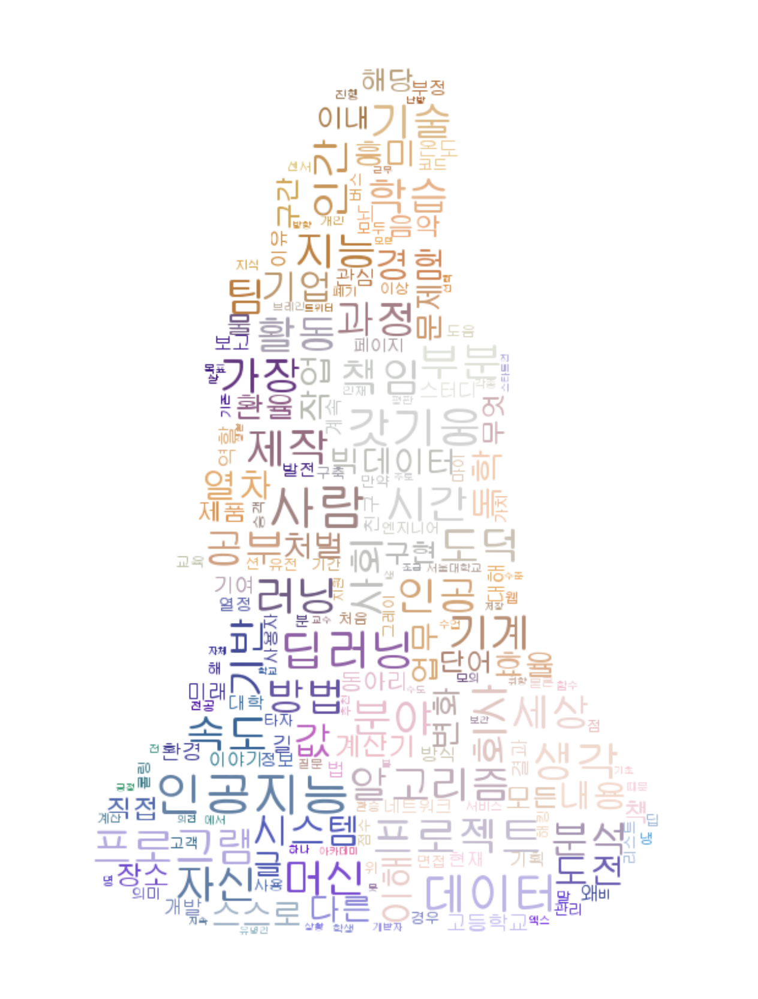

# Multipurpose_Word_Cloud

## 설치
<b>konlpy, nltk, matplotlib, wordcloud 설치가 필요</b>

> http://konlpy.org/en/latest/install/  

> https://www.nltk.org/install.html  

> https://matplotlib.org/faq/installing_faq.html  

> https://anaconda.org/conda-forge/wordcloud  

## How to use
위에 설치 작업을 완료했다고 가정하겠습니다.  

먼저 Word Cloud를 하고 싶은 글을 저장하고 keyword_count를 이용해서 Word Cloud에 필요한 준비를 합니다.  
`data = keyword_count("my.txt")`

글에 없지만 혹은 글에 있지만 더 크게 만들고 싶은 keyword를 아래와 같이 추가 합니다.  
`tmp_data["인공지능"]=150`

글 속에서 지우고 싶은 keyword를 아래와 같이 제거 합니다.  
`del(data["개"])`

이제 make_cloud 함수를 이용해서 프로그램을 출력합니다.  
`def make_cloud(tmp_data, back_image_n,state="no", font_n = "UnDinaru.ttf",background_color_n='white', max_font_size_n = 40):`  
```
back_image_n = "image 폴더에 있는 사진 중 Word Cloud의 모습이 되길 바라는 사진"
state = "Word Cloud의 표현되는 색"
       "no"         #랜덤하게 출력합니다.
       "grey"       #회색으로 출력합니다.
       "img"        #back_image_n 이미지의 색에 맞춰 출력합니다.
       (116,1,113)  #원하는 RGP로 표현합니다.
font_n = "Word Cloud에 적용할 폰트 이름"
background_color_n = "배경으로 바라는 색"
max_font_size_n = "Word Cloud에 표시할 글씨의 최대 크기"
```
하나의 예시 입니다.   
`make_cloud(data,back_image_n="skeleton_king.jpg" ,state="grey", background_color_n='black', max_font_size_n = 50, font_n="malgun.ttf")`  
 

## example
<b>이 프로그램을 이용해 만든 자기소개서 Word Cloud 예시입니다.</b>
  
  
  
  
  


## reference
> https://amueller.github.io/word_cloud/auto_examples/index.html
